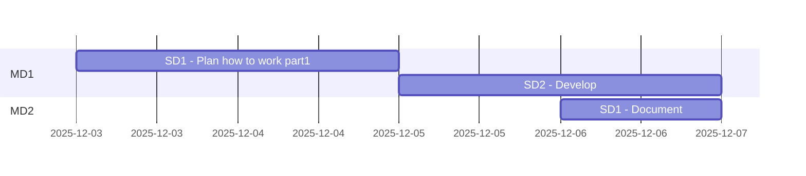

Title: Project management
Description: plans and project management sheets
Date: 
Robots: noindex,nofollow
Template: index
---

# ConvApp workshop

Abbreviations
> * PM Product Milestone
> * MD Milestone division
> * SD Subdivision


## Analyzing all parts

|#|Part|Details|Total Duration|Status|
|:-|:-|:-|:-|:-|
|1|[Develop](%base_url%/pm#Develop_timeplan)|2025-12-03 - |- hours|ONGOING|
|2|[Maintenance](%base_url%/pm#Maintenance_timeplan)|-|- hours|-|
|:-|:-|:-|::||


## Develop timeplan



## Maintenance timeplan

```mermaid
gantt
    section MD1
```

# Stories/cards MD1 - Develop

## Stories left over from [CalApp](https://github.com/hoss-java/calapp-workshop/blob/main/DECK.md)

>## 48-006
>### Recode CalApp as a spring project 
><details>
>    <summary>Details</summary>
>
>>The goal of this card is to recode CalAppV2 as a spring project.
>>
>>### DOD  (definition of done):
>>CalAppV2 is coded and pushed.
>>Finings are documented.
>>
>>### TODO :
>>- [ ] 1. 
>>
>>### Reports :
>>* 
>>
>>### Steps to test and debugging:
>>- [] 1.
>>
>>### References :
>>* []()
></details>
>
>
>## 48-007
>### Impliment CalApp to Tomcat as a service 
><details>
>    <summary>Details</summary>
>
>>The goal of this card is to develop a version of CalAppV2 to impliment to Tomcat as a service.
>>
>>### DOD  (definition of done):
>>All finings are documented.
>>CalAppV2 is coded and pushed.
>>
>>### TODO :
>>- [ ] 1. Document all findings
>>
>>### Reports :
>>* 
>>
>>### Steps to test and debugging:
>>- [] 1.
>>
>>### References :
>>* []()
></details>
>
>
>## 48-008
>### Investigate about useful tools. 
><details>
>    <summary>Details</summary>
>
>The goal of this card is to investigate about useful tools and methods (WOW) that can make it easre/faster >to code.
>>
>>### DOD  (definition of done):
>>All finings are documented.
>>
>>### TODO :
>>- [ ] 1. Document all findings
>>
>>### Reports :
>>* 
>>
>>### Steps to test and debugging:
>>- [] 1.
>>
>>### References :
>>* []()
></details>
>
>
>## 48-009
>### Spike how to automate tests 
><details>
><summary>Details</summary>
>
>>The goal of this card is to spike how to automate tests.
>>
>>### DOD  (definition of done):
>>All finings are documented.
>>
>>### TODO :
>>- [ ] 1. Document all findings
>>
>>### Reports :
>>* 
>>
>>### Steps to test and debugging:
>>- [] 1.
>>
>>### References :
>>* []()
></details>

## 49-001
### Create an empty Maven project for ConvApp 
<details>
    <summary>Details</summary>

>The goal of this card is to create and pushing an empty Maven project included README and DECK files.
>
>### DOD  (definition of done):
>ConvApp is created and pushed.
>
>### TODO :
>- [x] 1. README and DECK
>
>### Reports :
>* 
>
>### Steps to test and debugging:
>- [] 1.
>
>### References :
>* []()
</details>

## 49-002
### Plan how to work on ConvApp 
<details>
    <summary>Details</summary>

>The goal of this card is to recap wath are done before through CalApp and what are left over and need to be worked on.
>It also aims to have a plan with created cards to contnue working on ConvApp.
>
>### DOD  (definition of done):
>Cards are created and pushed.
>
>### TODO :
>- [ ] 1. Recap
>- [ ] 2. Plan
>- [ ] 3. Create stories
>
>### Reports :
>* 
>
>### Steps to test and debugging:
>- [] 1.
>
>### References :
>* []()
</details>


# Stories/cards MD2 - Develop


# Stories/cards MD1 - Maintenance